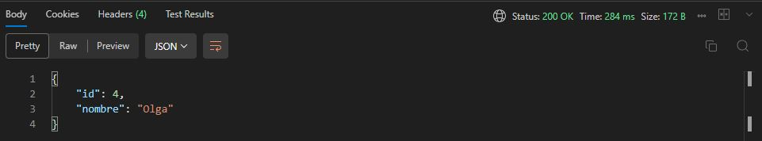

# Actividad-7
### Nombre: Erick Ramírez  

# API de Pacientes  

A continuación se muestran los detalles de cómo realizar operaciones CRUD (Crear, Leer, Actualizar, Eliminar) utilizando Postman.  

## Configuración inicial  

Antes de realizar las solicitudes, asegúrate de correr el proyecto con el comando `dotnet run` desde la terminal.
Posteriormente debes iniciar `POSTMAN` e iniciar sesión usando la siguiente direccion
```bash
http://localhost:5149/api/doctor/login?username=usuario&password=contraseña
```
Y en parametros se debe incluir:  
username: usuario  
password: contraseña   


Debería recibir un 'Status: 200 OK' junto con el token para usar en las siguientes peticiones  

  

# Pacientes  

Una vez que se obtenga el `token` tenemos que ubicarlo en la pestaña de Authorization y en `Type` seleccionamos Bearer Token y pegamos el Token obtenido anteriormente  

  

## Obtener todos los pacientes

- **Método:** `GET`
- **URL:** `http://localhost:5149/api/paciente`
- **Descripción:** Obtiene todos los pacientes almacenados.

Resultado esperado:  


## Obtener un paciente por ID

- **Método:** `GET`
- **URL:** `http://localhost:5149/api/paciente/1`
- **Descripción:** Obtiene los detalles de un paciente específico por su ID.

Resultado esperado:  


## Crear un nuevo paciente

- **Método:** `POST`
- **URL:** `http://localhost:5149/api/paciente`
- **Descripción:** Crea un nuevo paciente.
- **Datos del cuerpo (Body):** Se debe enviar el id y el nombre del paciente como el siguiente ejemplo en formato JSON
```bash
{
    "id": 4,
    "nombre": "Israel"
}
```
  

Resultado esperado:  


## Actualizar un paciente existente

- **Método:** `PUT`
- **URL:** `http://localhost:5149/api/paciente/{id}`
- **Descripción:** Actualiza los datos de un paciente existente por su ID.
- **Datos del cuerpo (Body):** Datos actualizados del paciente en formato JSON, por ejemplo se debe incluir el id y luego los demás datos:
```bash
{
    "id": 4,
    "nombre": "Olga"
}
```

Resultado esperado:  


## Eliminar un paciente

- **Método:** `DELETE`
- **URL:** `http://localhost:5149/api/paciente/{id}`
- **Descripción:** Elimina un paciente existente por su ID.

- Resultado esperado:  


# Doctor 

## Obtener todos los doctores

- **Método:** `GET`
- **URL:** `http://localhost:5149/api/doctor`
- **Descripción:** Obtiene todos los doctores almacenados.

Resultado esperado:  


## Obtener un doctor por ID

- **Método:** `GET`
- **URL:** `http://localhost:5149/api/doctor/{id}`
- **Descripción:** Obtiene los detalles de un doctor específico por su ID.

Resultado esperado:  


## Eliminar un doctor

- **Método:** `DELETE`
- **URL:** `http://localhost:5149/api/doctor/{id}`
- **Descripción:** Elimina un doctor existente por su ID.


